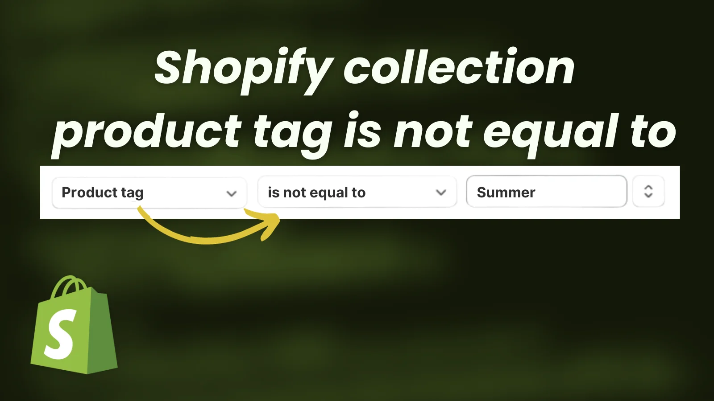

# Shopify collection product tag is not equal to

  

## Use case:
This script will help you create tag the products depending upon your conditions.
we are using [Shopify admin rest api](https://shopify.dev/docs/api/admin-rest/2023-07/resources/product) to get and update the products

## Follow these steps to implement the solution:
<ol>
  <li>Clone this repository: <strong>git clone https://github.com/saadsaif97/shopify-collection-product-tag-is-not-equal-to.git</strong></li>
  <li>Install the dependencies using: <strong>yarn install</strong></li>
  <li>Create new app from you shopify store: 
    <strong>settings -> Apps and sales channels -> Develop apps -> Create an app</strong>
  </li>
  <li>Configure Admin API scopes and give right to read_products and write_products</li>
  <li>Go to API credentials tab and install the app</li>
  <li>Copy: <strong>Admin API access token, API key and secret key</strong> and plug in the script</li>
  <li>Update the tags according to your needs</li>
  <li>Run the script and see the magic: <strong>yarn install</strong></li>
</ol>
